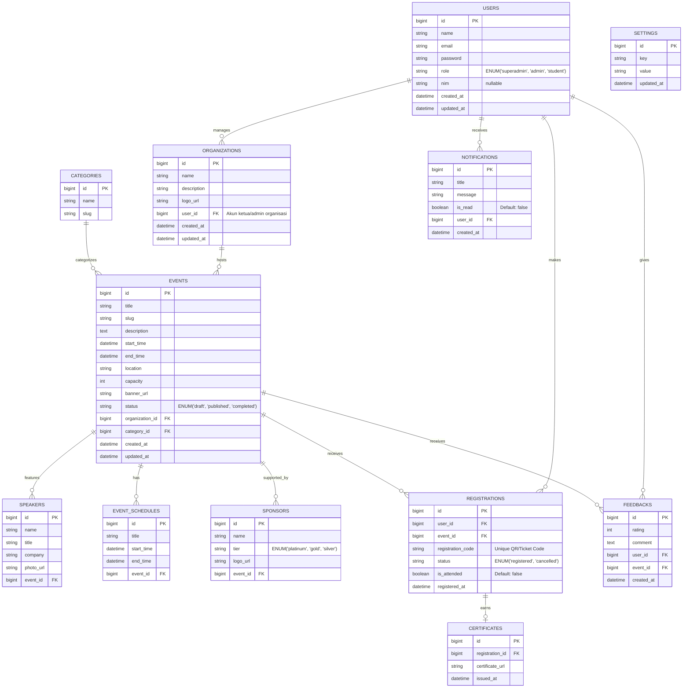

# Product Requirements Document (PRD)
**Nama Produk:** EventHub (Sistem Manajemen Event Kampus)
**Versi:** 1.0
**Tanggal:** 18 Juli 2026

---

## 1. Pendahuluan

### 1.1 Latar Belakang
Kampus memiliki banyak kegiatan kemahasiswaan seperti seminar, workshop, kepanitiaan, dan lomba. Saat ini, proses publikasi, pendaftaran, dan pendataan kehadiran masih sering dilakukan secara manual atau terpisah-pisah di berbagai platform (Google Forms, grup WhatsApp, dll). Hal ini menyulitkan panitia dalam mengelola peserta dan menyulitkan mahasiswa untuk menemukan event yang relevan.

### 1.2 Tujuan Produk
EventHub bertujuan untuk menjadi platform terpusat (*one-stop solution*) untuk seluruh kegiatan atau event di lingkungan kampus. Sistem ini akan mempermudah penyelenggara (BEM, Himpunan, UKM) dalam mempublikasikan acara dan mengelola peserta, sekaligus memudahkan mahasiswa dalam mendaftar dan melacak event yang mereka ikuti.

### 1.3 Target Pengguna
1. **Mahasiswa (Peserta):** Pengguna yang mencari, mendaftar, dan menghadiri event kampus.
2. **Admin/Panitia (Organisasi Kemahasiswaan):** Pengguna yang membuat event, mengelola kuota, melihat analitik peserta, dan melakukan absensi.
3. **Superadmin (Pihak Kampus):** Mengelola seluruh sistem, melakukan moderasi event, dan mengelola akun pengguna (verifikasi organisasi).

---

## 2. Ruang Lingkup & Fitur Utama

### 2.1 Modul Autentikasi & Otorisasi
- Login/Register untuk mahasiswa (menggunakan email kampus).
- Manajemen Role: Pembagian akses berdasarkan tingkat (Superadmin, Admin/Panitia, Peserta).

### 2.2 Modul Manajemen Event (Bagi Panitia)
- **CRUD Event:** Panitia dapat membuat, mengubah, membatalkan, dan menghapus event.
- **Detail Event:** Mencakup judul, deskripsi, pembicara, tanggal, waktu, lokasi (offline/online), kategori, kuota peserta, dan poster.
- **Status Event:** Draft, Published, Ongoing, Completed, Canceled.

### 2.3 Modul Pencarian & Pendaftaran Event (Bagi Peserta)
- **Dashboard Katalog:** Menampilkan daftar event terbaru dan event yang akan datang.
- **Filter & Search:** Mencari event berdasarkan kategori, tanggal, atau penyelenggara.
- **Pendaftaran:** Mahasiswa bisa mendaftar dengan satu klik (jika kuota masih tersedia).
- **Tiket Elektronik:** Generate tiket digital / QR code untuk keperluan *check-in* (absensi) pada hari H.

### 2.4 Modul Manajemen Peserta & Kehadiran
- **Daftar Pendaftar:** Panitia dapat melihat siapa saja yang mendaftar dan mengekspor data ke format Excel/CSV.
- **Check-in/Absensi:** Fitur pemindaian QR code atau absensi manual oleh panitia untuk memverifikasi kehadiran.

### 2.5 Modul Sertifikat Digital (E-Certificate)
- Otomatis melakukan *generate* e-certificate untuk peserta yang statusnya "hadir" (*attended*).
- Mahasiswa dapat mengunduh sertifikat langsung dari riwayat event di profil mereka.

---

## 3. Skema Data & Arsitektur

### 3.1 Penjelasan Naratif

Arsitektur EventHub dibangun berbasis sistem Monolitik menggunakan framework **Laravel** untuk kemudahan skalabilitas awal dan pengembangan yang cepat. Database menggunakan Relational Database Management System (RDBMS) seperti **MySQL** atau **PostgreSQL**.

Struktur data utama (Skema Database) terdiri dari beberapa entitas kunci:

1. **Users:** Menyimpan informasi kredensial dan profil. Memiliki field `role` untuk membedakan antara peserta, panitia, dan superadmin.
2. **Settings:** Menyimpan konfigurasi aplikasi secara umum (seperti nama aplikasi, logo, maintenance mode, dll).
3. **Organizations:** Menyimpan profil organisasi penyelenggara (BEM, UKM, dll) yang berafiliasi dengan akun panitia.
4. **Categories:** Tabel *lookup* untuk menyimpan kategori event (contoh: Seminar, Olahraga, Kesenian).
5. **Events:** Entitas utama yang menyimpan rincian acara. Berelasi dengan *Organizations* (sebagai penyelenggara) dan *Categories*.
6. **Registrations (Pendaftaran):** Tabel pivot/relasional yang menghubungkan *Users* (peserta) dan *Events*. Menyimpan status pendaftaran (seperti *Registered*, *Cancelled*) dan status kehadiran (*Attended*, *Absent*).
7. **Certificates:** Menyimpan referensi file sertifikat digital yang diterbitkan untuk registrasi tertentu.
8. **Speakers:** Menyimpan profil pembicara (nama, jabatan, perusahaan/instansi, foto) yang akan mengisi acara pada sebuah event.
9. **Event_Schedules:** Menyimpan rundown atau jadwal detail (sesi) yang terkait dengan sebuah event.
10. **Sponsors:** Menyimpan data sponsor (nama, logo, jenis sponsorship) yang mendukung sebuah event.
11. **Feedbacks:** Menyimpan ulasan, rating, dan masukan dari peserta (Users) setelah event selesai.
12. **Notifications:** Menyimpan riwayat notifikasi in-app untuk pengguna (seperti pengingat event, konfirmasi pendaftaran).

### 3.2 Visualisasi ERD (Entity Relationship Diagram)

Berikut adalah desain arsitektur database direpresentasikan melalui diagram ERD:

---

## 4. Non-Functional Requirements (NFR)
- **Security:** Menggunakan enkripsi password (Bcrypt/Argon2), proteksi CSRF, serta implementasi Rate Limiting untuk mencegah brute-force login.
- **Performance:** Halaman dashboard dan katalog event harus dimuat (load time) di bawah 3 detik. Menggunakan mekanisme Caching (Redis) untuk daftar event yang sedang trending.
- **Usability:** Antarmuka responsif (Mobile-first design) karena mayoritas mahasiswa akan mengakses platform menggunakan smartphone.

---
*Dokumen ini merupakan panduan dan spesifikasi dasar yang dapat berkembang (agile) seiring iterasi pengembangan produk.*
